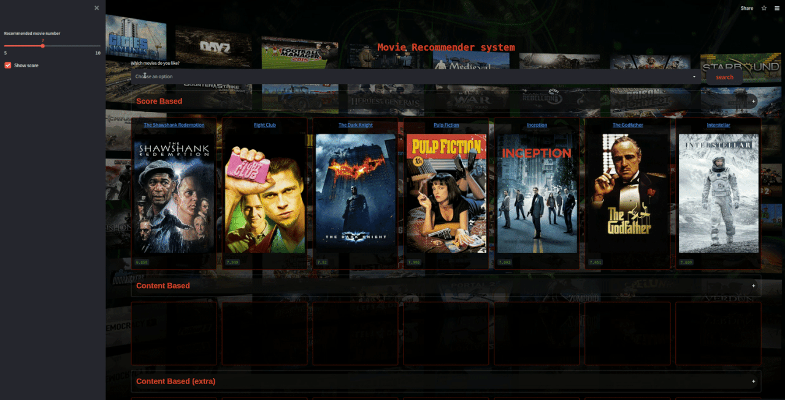

# MovieLens Recommendation Systems

This project implements recommendation systems using the MovieLens dataset. The main focus is on a content-based recommender system that suggests movies based on content similarity (e.g., genres, keywords, etc.).

## Project Overview

- **Content-Based Recommender:**  
  Uses features extracted from movies (like genres) to recommend similar movies. The system allows recommendations based on a single movie as well as on a user's history of selected movies.

- **Data Source:**  
  The movie data is derived from the MovieLens dataset. The dataset contains movie information, user ratings, and genres.

- **Key Features:**  
  - Transform movie genres into numerical features using vectorizers.  
  - Utilize nearest neighbors algorithms to compute similarities between movies.  
  - Recommend movies based on selected movie content or the aggregated content vector of several movies (history).

## Usage

1. **Data Preparation:**  
   Load the movies and ratings data using pandas. Ensure that you are using the correct file paths and encoding if necessary.

2. **Feature Extraction:**  
   Use vectorizers (e.g., CountVectorizer or TfidfVectorizer) to convert text-based data (like genres) into numerical feature arrays.

3. **Building the Recommender:**  
   The `ContentBasedRecommender` class in the project implements two main methods:
   - `recommend_on_movie(movie_title, n_recommendations=5)`: Provides recommendations based on a single movie.
   - `recommend_on_history(n_recommendations=5)`: Provides recommendations based on the user's browsing history.
## Contributing

Contributions are welcome! Please create a pull request or open an issue to suggest improvements or report bugs.

.

## Acknowledgments

- [MovieLens Dataset](https://grouplens.org/datasets/movielens/)
- [scikit-learn Documentation](https://scikit-learn.org/stable/)
